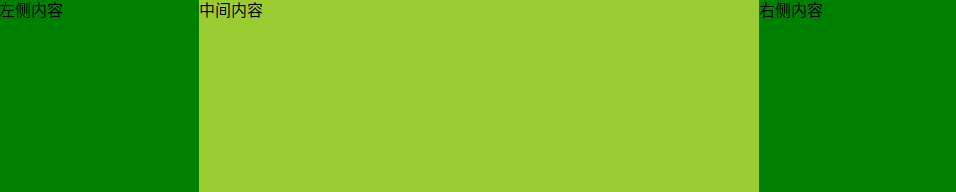

# HTML/CSS

## 1：浏览器解析渲染页面过程

HTML解析构建DOM-&gt;CSS解析构建CSSOM树-&gt;根据DOM树和CSSOM树构建render树-&gt;根据render树进行布局渲染render layer-&gt;根据计算的布局信息进行绘制

## 2：布局渲染的过程发生的回流和重绘区别&减少回流次数的方法

区别：

* 回流指当前窗口发生改变，发生滚动操作，或者元素的位置大小相关属性被更新时会触发布局过程，发生在render树
* 重绘指当前视觉样式属性被更新时触发的绘制过程，发生在渲染层render layer

减少回流次数的方法：

* 1）避免一条一条的修改DOM样式，而是修改className或者style.classText
* 2）对元素进行一个复杂的操作，可以先隐藏它，操作完成后在显示
* 3）在需要经常获取那些引起浏览器回流的属性值时，要缓存到变量中
* 4）不使用table布局，一个小的改动可能就会引起整个table重新布局
* 5）在内存中多次操作节点，完成后在添加到文档中

## 3：关于transform开启GPU加速渲染，相比top&left，优势在哪里

> 页面性能优化有一条，用transform代替top，left来实现动画。那么transform的优势在哪里？如何开启GPU加速渲染？开启GPU硬件加速可能会触发的问题，如何解决？

首先相比定位的top&left来说，transform不会引起整个页面的回流和重绘。其次我们可以通过transform开启GPU硬件加速，提高渲染速度，但相应的transform也会占用更多的内存。

## 4：transform如何开启GPU硬件加速

```css
.box{
    transform:translateZ(0);
    //或者
    transfor:translate3d(0,0,0);
}
```

## 5：开启GPU硬件加速可能会触发哪些问题，如何处理

可能会导致浏览器频繁闪烁或者抖动，解决方案：

```css
.box{
    backface-visibility: hidden;
    perspective: 1000;
    -webkit-backface-visibility: hidden;
    -webkit-perspective: 1000;
}
```

## 6：移动端点透现象有遇到过嘛

首先需要了解的是，移动端在touch上一共有4个事件，

执行顺序为`touchstart -> touchmove -> touchend -> touchcancel`

当用户点击屏幕时，会触发touch和click事件，touch事件会优先处理，touch事件经过捕获，目标，冒泡一系列流程处理完成之后，才会触发click，所有我们经常会谈到移动端点击事件300ms延迟的问题

移动端点击事件300ms问题，常见的解决方案：

* 阻止用户双击缩放，并限制视口大小

```markup
<meta name="viewport" content="width=device-width,initial-scale=1,minimum-scale=1,maximum-scale=1,user-scalable=no"/>
```

* 设置css`touch-action`用于指定某个给定的区域是否允许用户操作，以及如何相应用户操作

```css
* {
  touch-action: none;
}
```

* fastclick.js来解决，其原理是在检测到touchend事件的时候，会通过自定义事件立即触发模拟一个click事件，并在300ms之后把真正的click事件阻止掉

#### 点透现象

发生条件：①按钮A和按钮B不是后代继承关系，②A发生touch，A touch后立即消失，B绑定click，③A z-index大于B，即 A 显示在 B 浮层之上

发生原因：当点击屏幕时，系统生成touch和click两个事件，touch先执行，touch执行完之后A消失，然后要执行click的时候，就会发现用户点击的是B，所以就执行了B的click

解决方法：①阻止默认事件，在touch的某个时间段执行event.preventDefault，去取消系统生成的click事件，一半在 touchend 中执行。②要消失的元素延迟300ms后在消失

## 7：Doctype是什么，三种模式的区别在什么地方

Doctype是一种DTD文档定义类型，必须声明在HTML文档的第一行，用来规范文档使用哪种方式解析HTML，三种模式分别是怪异模式，标准模式，近乎模式\(IE8的一种近乎于前两者之间的一种模式\)；标准模式按照HTML和CSS定义渲染，怪异模式会模拟更旧的浏览器行为

## 8：说说对两种盒模型的理解

标准盒模型和IE怪异盒模型，标准盒模型下：盒子总宽度/高度=width/height+padding+border+margin [](https://camo.githubusercontent.com/11f03b0d6118eea403a33fe2d64205ad66256e3f/687474703a2f2f7777772e6368656e7161712e636f6d2f6173736574732f696d616765732f626f782d6d6f64656c312e706e67)

怪异盒模型，IE5.X 和 6 在怪异模式中使用自己的非标准模型，盒子的总宽度和高度是包含内边距padding和边框border宽度在内的：盒子总宽度/高度=width/height + margin = width/height + margin; [](https://camo.githubusercontent.com/fe676305e5f72b3e682664a683697eac68e0eb37/687474703a2f2f7777772e6368656e7161712e636f6d2f6173736574732f696d616765732f626f782d6d6f64656c322e706e67)

```css
box-sizing : content-box || border-box || inherit;
```

boxsizing属性content-box使用标准盒模型的计算方式，border-box则使用怪异盒模型的计算方式

## 9：关于IFC和BFC，哪些元素会触发BFC

BFC块级格式化上下文，IFC行级格式化上下文，

哪些元素会触发BFC：

* 根元素
* float的属性不为none
* position属性为absolute或fixed
* display为inline-block，table-cell，table-caption，flex
* overflow不为visible

## 10：CSS定位的方式有哪些分别相对于谁

```css
static(默认值)
absolute(绝对定位，相对于最近已定位的父元素，如果没有则相对于<html>)
fixed(固定定位，相对于窗口)
relative(相对定位，相对于自身)
sticky(2017年浏览器开始支持，粘性定位)
```

absolute会使元素位置与文档流无关，不占据空间，absolute 定位的元素和其他元素重叠

relative相对定位时，无论元素是否移动，仍然占据原来的空间

sticky是2017年浏览器才开始支持，会产生动态效果，一个实例是"[动态固定](http://www.ruanyifeng.com/blog/2019/11/css-position.html)"，生效前提是必须搭配`top,left,bottom,right`一起使用，不能省略，否则等同于`relative`定位，不产生"动态固定"的效果

## 11：移动端布局的解决方案，平时怎么做的处理

* 使用Flexbox
* 百分比布局结合媒体查询
* 使用rem

rem转换像素大小（根元素的大小乘以rem值），取决与页面根元素的字体大小，即HTML元素的字体大小

em转换像素大小（em值乘以使用em单位的元素的字体大小），比如一个div的字体大小为16px，那么10em就是180px（或者接近它）


rem平时怎么做的转换：为了方便计算，时常将html的字体大小设置为62.5%，那么12px就会是1.2rem


## 12：垂直水平居中的多种解决方案

### 未知宽高元素实现垂直水平居中

① flex实现水平垂直居中

```css
.parent {
    display: flex;
    justify-content: center;
    align-items: center;
    width: 600px;
    height: 600px;
    margin: auto;
    border: 1px solid yellow;
}

.child {
    width: 100px;
    height: 100px;
    border: 1px solid blue;
}
```

② 进行垂直水平居中（利用transform中translate偏移的百分比值是相对于自身大小的特性）

```css
.parent {
      position: relative;
      width: 600px;
      height: 600px;
      margin: auto;
      border: 1px solid yellow;
    }

.child {
      position: absolute;
      width: 100px;
      height: 100px;
      border: 1px solid blue;
    }

.method3 {
      top: 50%;
      left: 50%;
      transform: translate(-50%, -50%);
    }
```

### 已知宽高元素的垂直水平居中

① 绝对定位+`margin:auto`

```css
.parent {
  position: relative;
  width: 600px;
  height: 600px;
  margin: auto;
  border: 1px solid red;
}

.child {
  position: absolute;
  margin: auto;
  top: 0;
  left: 0;
  right: 0;
  bottom: 0;
  width: 100px;
  height: 100px;
  border: 1px solid blue;
}
```

② 使用绝对定位与负边距

```css
.parent {
      position: relative;
      width: 600px;
      height: 600px;
      margin: auto;
      border: 1px solid red;
    }

.child {
      position: absolute;
      top: 50%;
      left: 50%;
      margin: -50px 0 0 -50px;
      width: 100px;
      height: 100px;
      border: 1px solid blue;
}
```

## 13：经典的三栏布局的实现方式

三栏布局：两侧定宽中间自适应，在开发中很常见的布局方式，主要有下面六种实现方式：

* 最简单的方式就是通过float实现
* 利用绝对定位
* 利用BFC规则
* 圣杯布局（通过margin负值调整）
* 双飞翼布局（和双飞翼布局类似，只是处理中间栏被遮挡的方式不同：双飞翼布局在中间栏内部加一个div，设置其margin来避开遮挡）
* 利用flex布局 👇 _Q14_ 

## 14：对flex布局的了解，flex如何实现经典的三栏布局

flex意为弹性布局，有两大概念，一是容器\(container\)，二是项目\(item\)，两者都有各自的六个常用属性

用在容器上的六个属性：

* `flex-direction`主轴的方向，
* `flex-wrap`一条轴线装满，如何换行，
* `flex-flow`是前两者的简写，
* `justify-content`项目在主轴上的对齐方式
* `align-items`在交叉轴上如何对齐
* `align-content`多跟轴线的对齐方式

用在项目上的六个属性:

* `order`排序顺序，默认为0，越小越靠前
* `flex-grow`项目的放大比例，默认为0，不放大
* `flex-shrink`项目的缩小比例，默认为1，空间不足该项目会缩小
* `flex-basis`项目占据主轴空间大小
* `flex`是上面放大，缩小，大小三者的简写，默认为0 1 auto
* `align-self`允许单个项目有不同于其他的对齐方式

```markup
<!--flex实现经典的三栏布局-->
<style>
.flex-container{
        display: flex;
        height: 200px;
}
.middle {
        height: 200px;
        background-color: yellowgreen;
    flex-grow: 1;
}
.left,.right {
    height: 200px;
    flex: 0 1 200px;
    background-color: green;
}

</style>

<div class="flex-container">
        <div class="left">左侧内容</div>
        <div class="middle">中间内容</div>
        <div class="right">右侧内容</div>
</div>
```



## 15：说说你知道的清除浮动的方法，知道其中的原理嘛

清除浮动主要是为了解决父元素因为子元素浮动内部高度为0的问题

* 额外标签，即在最后一个浮动标签后加一个空div，给其设置`clear:both`，缺点是增加无意义标签，语义化差
* 给父级元素添加`overflow:不为visible`通过触发BFC的方式清除浮动
* 使用after伪元素，缺点是IE6-7不支持伪元素，zoom:1触发hasLayout

```css
.clearfix:after{
    content:"";
    display:block;
    height:0;
    clear:both;
    visibility:hidden;
}
.clearfix{
    *zoom:1; /*ie6清除浮动的方式 *只有IE6-IE7执行*/
}
```

* 使用before和after双伪元素清除浮动

```css
.clearfix:after,.clearfix:before{
    content:'';
    display:table;
}
.clearfix:after{
    clear:both;
}
.clear{
    *zoom:1;
}
```

> 问题准备
>
> * margin塌陷及合并问题

